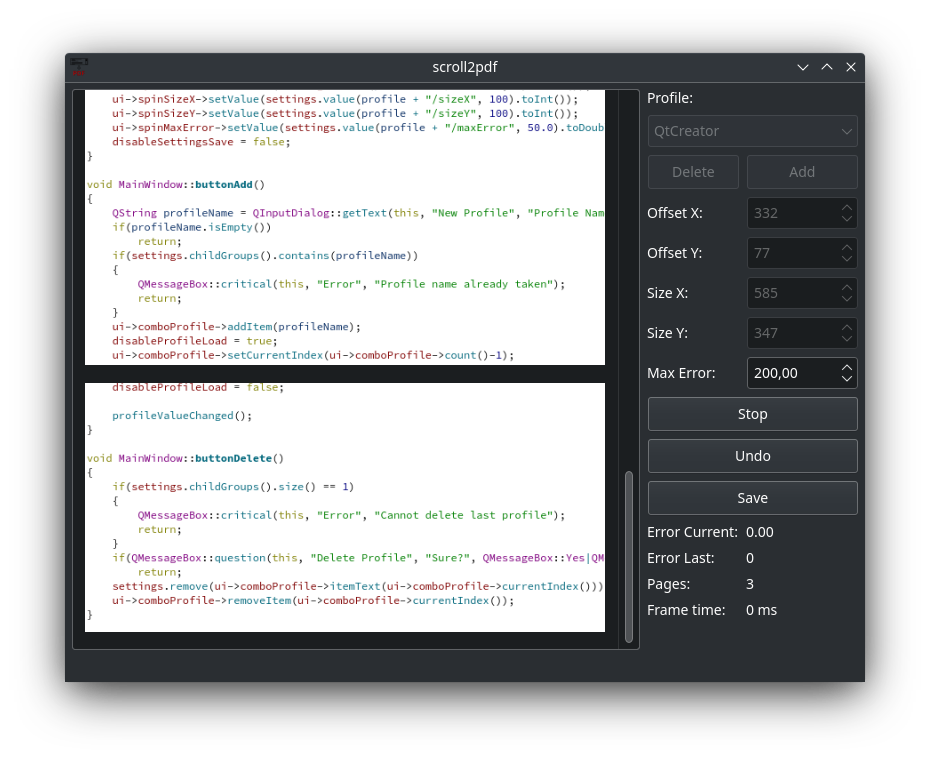

# scroll2pdf
`scroll2pdf` contineously takes screenshot of a previously defined area. You can then scroll down in that area and `scroll2pdf` will stich the taken images back together. It will also split the image into A4 pages and try to search for good splitting points where nothing is cut.

You can then export the scanned document into a PDF or the raw png images. `scroll2pdf` will also ask you to run `ocrmypdf` to do OCR on the PDF.

There are a lot of thing not working perfectly or missing, which may be considered a TODO list:

- You can only capture images from your main screen.
- The selection process of the window area to capture is a bit inconvenient.
- The CPU load is fairly high. This is caused by the algorithm trying to find the offset of the currently captured imaged compared to the current state of the document.
- Depnding on the document you are scanning, you have to adjust the error thresthold. The application therefore tells you the current best error in the image matching process.
- The application basically only works when you have two monitors as you need to watch its progress while scrolling.
- Sometimes it happens that you get some small errors in the images, because the application you are scanning did not update the scrolled area fast enough (especially when a browser is loading stuff). It will then not detect any futher images and you have to use the undo button to remove a few previous steps to get it back on track.
- A manual selection for page breaks would be nice, but that probably a bit of work.

## Build
### Linux
You need Qt5+, then:
```sh
$ qmake
$ make
$ sudo make install
```

### Windows
Tell me...

### Mac
Tell me...

## Screenshot

